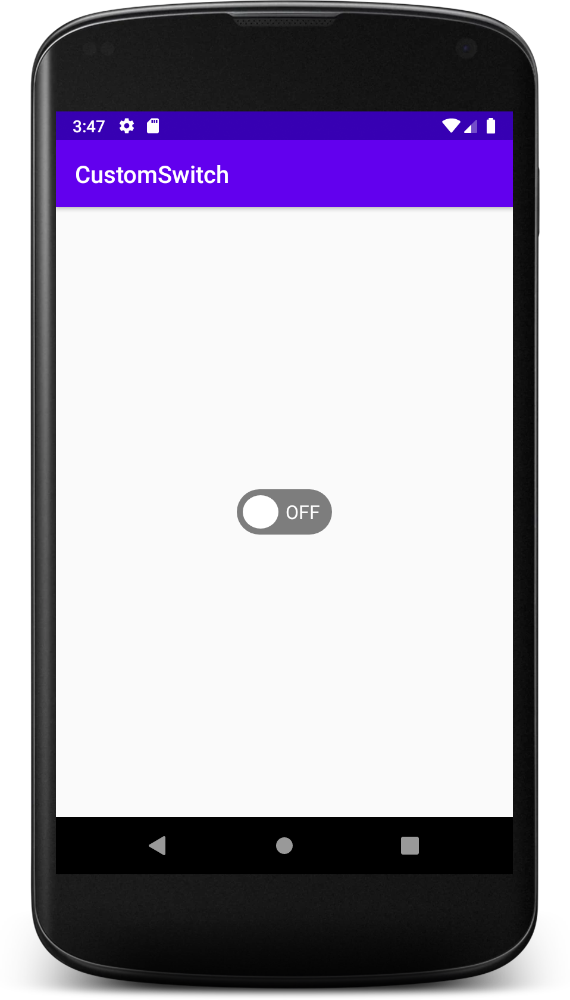
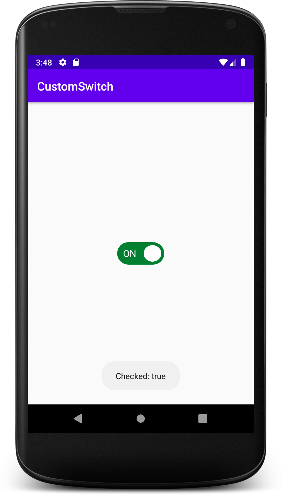

# CustomSwitchAndroid

UpWork like switch design in Andorid

### Switch Mode Off

----------------------------------------------
### Switch Mode On

# Inspiration
Inspired by [uigitdev/CustomSwitchWithIcon](https://github.com/uigitdev/CustomSwitchWithIcon)
